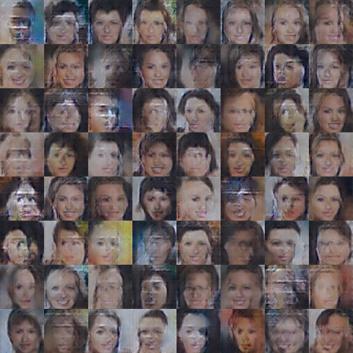
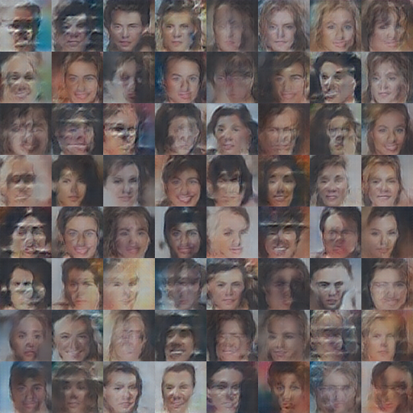

# dcgan.caffe: A pure caffe-python implementation of [DC-GAN](https://github.com/soumith/dcgan.torch)
======================================================================================

As far as I know, there is no light-weight implementation of DCGAN based on caffe.

Inspired by [DeePSiM](http://lmb.informatik.uni-freiburg.de/resources/binaries/arxiv2016_alexnet_inversion_with_gans/release_deepsim_v0.5.zip) implementation, a few lines of python code can train the dcgan model quickly without any hack in caffe core lib ([Dosovitskiy](https://github.com/dosovits/caffe-fr-chairs/tree/deepsim) has already done this. However, I think the code could be merged back to master branch).

## Dependency
You will need to compile the [deepsim-caffe-branch](https://github.com/dosovits/caffe-fr-chairs/tree/deepsim). And make sure your `PYTHONPATH` point to it.

The deepsim-caffe only support cudnn-4.0. If disable the cudnn engine and replace some convolution layers with the master branch, a latest cudnn and cuda will work fine.

## Training
For face generator, please prepare [celebA](https://github.com/soumith/dcgan.torch#11-train-a-face-generator-using-the-celeb-a-dataset) dataset as the link said. Then make a train list file and put it in the data.prototxt.

Just typing
```
python train.py
```

## Visualization
To view the model result by
```
python generate.py generator.prototxt snapshots_test/4000/generator.caffemodel
```

The visualizations of the models at iteration 3000 and 4000 are as following:




